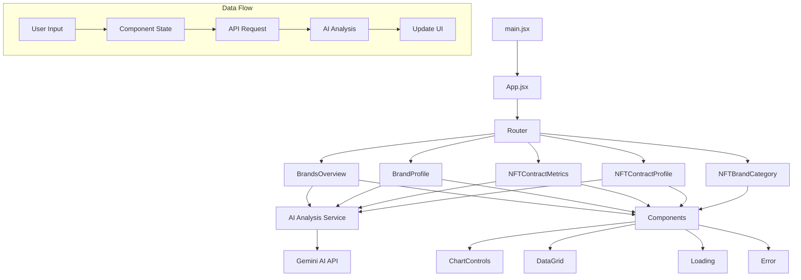
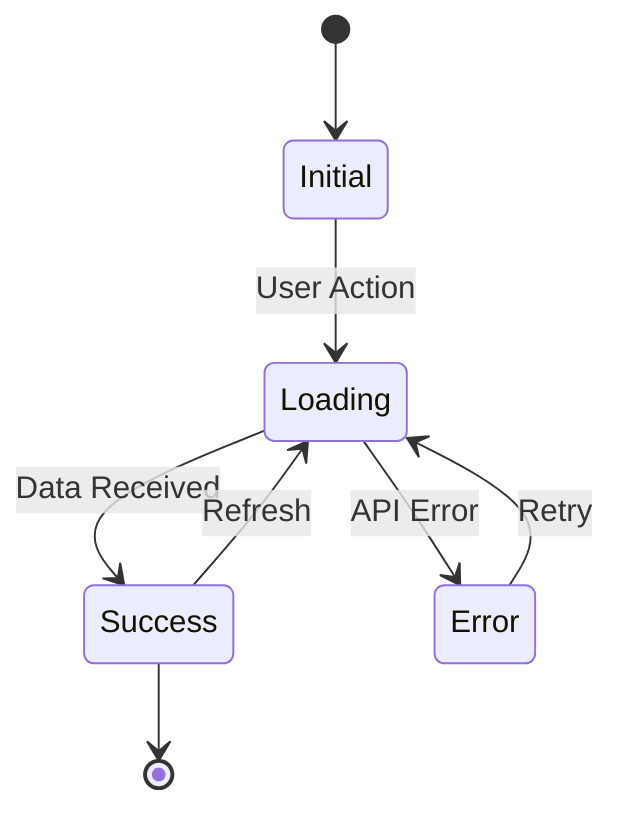
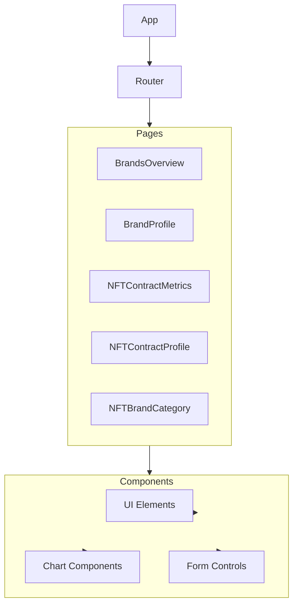

# BrandCrunch Project Architecture

## Component Structure and Data Flow

## Data Flow Description

1. **Entry Point**
   - `main.jsx` initializes the React application
   - `App.jsx` sets up routing and global state

2. **Main Pages**
   - BrandsOverview: Shows all NFT brands and metrics
   - BrandProfile: Detailed view of a single brand
   - NFTContractMetrics: Contract-level metrics and analysis
   - NFTContractProfile: Detailed contract analysis
   - NFTBrandCategory: Brand categorization

3. **AI Integration**
   - AI Analysis Service processes data
   - Communicates with Gemini AI API
   - Returns structured insights

4. **Components**
   - Shared UI components
   - Chart controls for data visualization
   - Data grids for metric display
   - Loading and error states

5. **Data Flow**
   - User interacts with UI
   - Component state updates
   - API requests triggered
   - AI analysis performed
   - UI updates with results

## State Management

## Component Hierarchy

