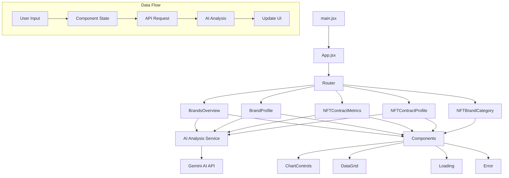
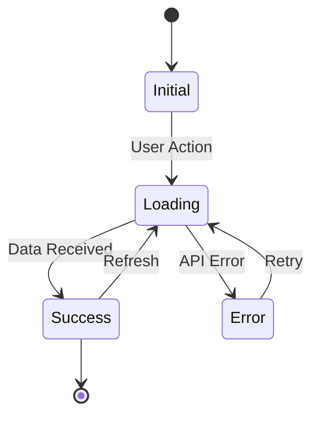
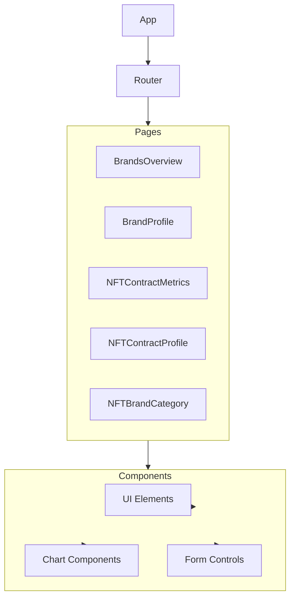

# BrandCrunch - NFT Analytics Platform

BrandCrunch is a comprehensive NFT analytics platform that provides detailed insights into NFT brands, contracts, and market performance. The platform uses AI-powered analysis to deliver actionable insights and recommendations.

## Features

- **Brand Overview**: Comprehensive analysis of NFT brands with key metrics and performance indicators
- **Contract Metrics**: Detailed analysis of individual NFT contracts with AI-powered insights
- **Brand Profile**: In-depth brand analysis with historical data and trends
- **Contract Profile**: Detailed contract-level analysis with AI recommendations
- **Brand Categories**: Categorized view of NFT brands for better market understanding
- **AI Analysis**: Powered by Google's Gemini AI for real-time market insights

## Project Structure

```
src/
├── components/        # Reusable UI components
├── pages/            # Main application pages
│   ├── BrandsOverview.jsx        # Brand overview and analysis
│   ├── BrandProfile.jsx          # Detailed brand profiles
│   ├── NFTContractMetrics.jsx    # Contract metrics and analysis
│   ├── NFTContractProfile.jsx    # Detailed contract profiles
│   └── NFTBrandCategory.jsx      # Brand categorization
├── services/         # Backend services and API integrations
│   └── aiAnalysis/   # AI analysis services
├── lib/             # Utility functions and helpers
└── main.jsx         # Application entry point
```

## Technology Stack

- **Frontend**: React.js with Vite
- **UI Framework**: Tailwind CSS
- **AI Integration**: Google Gemini AI
- **State Management**: React Hooks
- **Routing**: React Router
- **Data Visualization**: Chart.js

## Application Flow

1. **Brand Overview**
   - Displays all NFT brands with key metrics
   - Provides AI-powered brand analysis
   - Allows sorting and filtering of brands

2. **Contract Metrics**
   - Shows detailed contract-level metrics
   - Provides AI analysis of contract performance
   - Includes recommendations and risk assessment

3. **Brand Profile**
   - Detailed view of individual brands
   - Historical performance data
   - Related contracts and metrics

4. **Contract Profile**
   - In-depth contract analysis
   - Performance metrics and trends
   - AI-powered insights and recommendations

## Setup

1. Clone the repository
2. Install dependencies:
   ```bash
   npm install
   ```
3. Create a `.env` file with required API keys:
   ```
   VITE_GEMINI_API_KEY=your_gemini_api_key
   ```
4. Start the development server:
   ```bash
   npm run dev
   ```

   # BrandCrunch Project Architecture

## Component Structure and Data Flow



## Data Flow Description

1. **Entry Point**
   - `main.jsx` initializes the React application
   - `App.jsx` sets up routing and global state

2. **Main Pages**
   - BrandsOverview: Shows all NFT brands and metrics
   - BrandProfile: Detailed view of a single brand
   - NFTContractMetrics: Contract-level metrics and analysis
   - NFTContractProfile: Detailed contract analysis
   - NFTBrandCategory: Brand categorization

3. **AI Integration**
   - AI Analysis Service processes data
   - Communicates with Gemini AI API
   - Returns structured insights

4. **Components**
   - Shared UI components
   - Chart controls for data visualization
   - Data grids for metric display
   - Loading and error states

5. **Data Flow**
   - User interacts with UI
   - Component state updates
   - API requests triggered
   - AI analysis performed
   - UI updates with results

## State Management



## Component Hierarchy




## AI Analysis Features

- **Brand Analysis**: Comprehensive analysis of brand performance and market position
- **Contract Analysis**: Detailed analysis of contract metrics and trading patterns
- **Risk Assessment**: AI-powered risk evaluation and recommendations
- **Performance Scoring**: Numerical scoring system for quick assessment
- **Growth Analysis**: Trend analysis and growth indicators

## Contributing

1. Fork the repository
2. Create your feature branch
3. Commit your changes
4. Push to the branch
5. Create a new Pull Request

## License

This project is licensed under the MIT License - see the LICENSE file for details.
#
